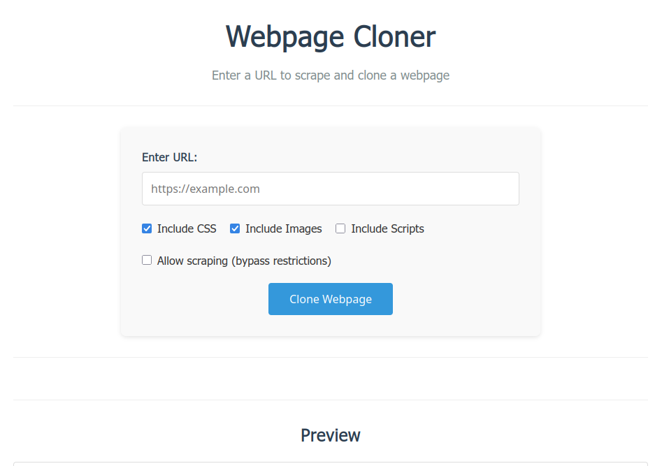

# Webpage Cloner

A web application that allows users to scrape and clone entire webpages with their assets. The application provides a user-friendly interface to enter URLs and download complete HTML copies of webpages.

## Features

- **Intuitive UI**: Clean and responsive design for easy use
- **Customizable cloning**: Options to include/exclude CSS, images, and scripts
- **Real-time preview**: See the cloned webpage before downloading
- **Asset management**: Downloads and embeds CSS, images, and scripts
- **Security conscious**: Respects same-domain policies and sanitizes file names
- **Ethical scraping**: Includes option to bypass robots.txt with appropriate warnings

## Screenshots



*Screenshot of the main interface showing URL input, options (including the new "Allow scraping" option), and results sections*

For a complete view of the UI, see [screenshot-ui.html](screenshots/screenshot-ui.html) which demonstrates the interface layout in a browser.

## Tech Stack

- **Frontend**: HTML, CSS, JavaScript
- **Backend**: Node.js with Express
- **Dependencies**: 
  - axios (for HTTP requests)
  - cheerio (for HTML parsing)
  - cors (for handling cross-origin requests)
  - sanitize-filename (for security)

## Installation

1. Clone this repository:
```bash
git clone <repository-url>
cd webpage-cloner
```

2. Install dependencies:
```bash
npm install
```

3. Start the server:
```bash
npm start
```

4. Open your browser and navigate to `http://localhost:3000`

## Usage

1. Enter the URL of the webpage you want to clone
2. Select your preferred options (include CSS, images, scripts)
3. Optionally check "Allow scraping (bypass restrictions)" if needed (with appropriate warnings)
4. Click "Clone Webpage"
5. Wait for the cloning process to complete
6. Preview the cloned webpage or download it

## Testing the Server

You can test the server directly using curl:

```bash
curl -X POST http://localhost:3000/api/clone \
  -H "Content-Type: application/json" \
  -d '{
    "url": "https://httpbin.org/html",
    "options": {
      "includeCss": true,
      "includeImages": false,
      "includeScripts": false,
      "ignoreRobots": false
    }
  }'
```

The server will return a JSON response with details about the cloned file.

## Security Notes

- The application only processes assets from the same domain as the main page
- Filenames are sanitized to prevent directory traversal attacks
- A sandboxed iframe is used for content preview

## Limitations

- Cannot clone pages with complex JavaScript-generated content
- Websites may have anti-scraping measures that block requests
- Assets from external domains are excluded for security
- Respects robots.txt by default; option to bypass with appropriate warnings
- Always check website terms of service before scraping

## License

MIT License - see LICENSE file for details

## Contributing

1. Fork the repository
2. Create a feature branch (`git checkout -b feature/amazing-feature`)
3. Commit your changes (`git commit -m 'Add some amazing feature'`)
4. Push to the branch (`git push origin feature/amazing-feature`)
5. Open a Pull Request